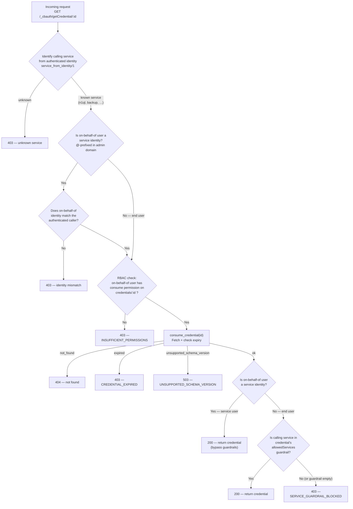

# Credential Store — Architecture & Design

This document covers the internal design of the credential store: chronicle storage, encryption model, RBAC internals, authorization flow, and known issues.
For the REST API see [rest-api-reference.md](rest-api-reference.md).
For service integration see [service-integration-guide.md](service-integration-guide.md).

## Storage

Credentials are stored in chronicle under the key `{credentials, Id}`, where `Id` is the credential's string identifier.
The list of all credential IDs is maintained separately under the `credential_ids` key.
Credential store settings live under `credential_store_settings`.
See `cb_credentials_store.erl` for implementation details.

**Encryption at rest.** Credentials are stored encrypted at rest via config encryption (required by default).
Once the config is loaded into memory they are held unencrypted.

**Prerequisites for credential operations.** Every credential store operation — create, read, list, update, delete, **and** consume — calls `ensure_prerequisites/1`, which requires:

1. **All nodes at Totoro (8.1) or later** — the credential store is a Totoro feature; mixed-version clusters with pre-8.1 nodes cannot use it.

2. **Enterprise edition** — the credential store is an Enterprise-only feature.

3. **Config encryption enabled** — credentials on disk are encrypted by the cluster's config-encryption key.
   Config encryption is enabled by default.

4. **Node-to-node (n2n) encryption enabled on all nodes**\* — credentials replicated between nodes via chronicle are protected by n2n encryption.
   N2n encryption is **not** enabled by default.

\* The n2n encryption check is **best-effort**: it reads `ns_config` (which is eventually consistent) outside the chronicle transaction, so there is a small window for race conditions.
See [MB-71345](https://jira.issues.couchbase.com/browse/MB-71345) for details and the plan to provide transactional guarantees.

If any prerequisite is not met, the credential store returns an error and the operation is rejected.

**Overrides (encryption only).** The `/settings/credentialStore` endpoint provides two boolean overrides (`configEncryptionOverride`, `n2nEncryptionOverride`) that relax the encryption prerequisites (3 and 4 above).
When an override is set to `true`, the corresponding encryption check is skipped and credential operations proceed.
This is useful for development or environments where the encryption requirement cannot be met.
With config encryption disabled, credentials are exposed on storage.
With n2n encryption disabled, credentials can be replicated to other nodes in the clear.
The version and edition prerequisites (1 and 2) cannot be overridden.

**Preventing encryption toggle-off.** Separately, ns_server also prevents an admin from disabling config encryption or n2n encryption when credentials already exist in the store (unless the corresponding override is set).
Disabling config encryption returns an error listing the affected credential IDs and directs the admin to set `configEncryptionOverride`.
Likewise for n2n encryption and `n2nEncryptionOverride`.

**Warnings.** Even when overrides are set, ns_server emits warnings in the response body when listing credentials (`GET /settings/credentials`) or querying credential store settings (`GET /settings/credentialStore`) if credentials exist and either config encryption is disabled or n2n encryption is not enabled on every node in the cluster.

## RBAC Model

**Resource model.** Each credential is an RBAC resource addressed as `credentials[<id>]`, analogous to `bucket[<name>]`.

**Permissions on a credential resource:**

| Permission | Description |
|---|---|
| `read` | Read credential metadata (secrets redacted) |
| `write` | Create, update, or delete a credential |
| `consume` | Decrypt and retrieve the credential's secret fields |

**Access control summary:**

- **Security Admin** can create, read, update, delete, and list credentials.
  Read operations do **not** return sensitive material in the payload.
- **Consume** permissions must be **explicitly granted** — to end users (local, external) or to internal service accounts (`@cbq-engine`, `@eventing`, `@cbas`, etc.).
  Internal service accounts do **not** see any credentials unless granted the `credential_consumer` role.
- ns_server checks RBAC permissions when a service or user consumes the credential.

### Role summary

| Role | Parameterised By | Permissions Granted | Assignable To |
|---|---|---|---|
| `credential_consumer` | `credential_id` | `{[{credentials, <id>}], consume}` | End users **and** services |
| `service_admin` | *(internal)* | All permissions **except** any credential access. See [below](#service_admin--design-and-known-limitations) | Service identities only (implicit, Totoro+) |
| `admin` (Full Admin) | — | Everything including CRUD on `/settings/credentials` and service role grants | Human administrators |
| `security_admin` | — | `{[admin, security], all}` — CRUD on credentials and credential store settings. **Cannot** manage users/service roles (`{[admin, security, admin], none}`, `{[admin, users], [read]}`) | Human administrators |
| `user_admin_local` | — | `{[admin, users], all}` (except admin domain) — assign roles to local users including `credential_consumer`. **Cannot** CRUD credentials | Human administrators |
| `user_admin_external` | — | `{[admin, users], all}` (except admin/local domain) — assign roles to external users including `credential_consumer`. **Cannot** CRUD credentials | Human administrators |

### Role separation and privilege escalation analysis

> **Key insight — no circular privilege escalation:**
>
> - **Security Admin** can CRUD credentials and store settings, but has `{[admin, security, admin], none}` which blocks writing to the admin domain.
>   It cannot assign roles to users (`{[admin, users], [read]}` — read only) or service identities.
>   It cannot grant itself `credential_consumer`.
>
> - **User Admin** can assign `credential_consumer` (and other non-security roles) to end users.
>   It has `{[admin, security], none}` — it cannot create, read, or modify credentials.
>   It cannot access the service roles endpoint.
>
> - **Full Admin** (`{[], all}`) is the only role that can both CRUD credentials AND manage service roles.
>
> - The `service_admin` role (implicitly assigned to all `@`-prefixed service users) explicitly **excludes** credential permissions (`{[{credentials, any}], none}`).
>   Services must be explicitly granted `credential_consumer[<pattern>]` via `PUT /settings/rbac/services/:service/roles` by a Full Admin.

### Role separation background

The separation of User Admin and Security Admin dates back to Morpheus (8.0).
The `when_79` guards in `menelaus_web.erl` refer to analytics releases; for Couchbase Server, this separation was available from 8.0 onwards (Morpheus).

What **is** new in Totoro (8.1) is:
- The **credential store** itself (CRUD, consume, guardrails).
- The **`service_admin`** internal role, which strips credential permissions from service identities so they must be granted `credential_consumer` explicitly.
- The **`credential_consumer`** role and the service roles endpoint (`/settings/rbac/services/:name/roles`).

The existing User Admin / Security Admin separation applies to credential management as follows:

| Responsibility | Role | Key Permission |
|---|---|---|
| Create / edit / delete credentials; manage credential store settings | **Security Admin** or Full Admin | `{[admin, security], write}` |
| Assign roles to end users (including `credential_consumer`) | **User Admin** (local / external) or Full Admin | `{[admin, users], write}` |
| Assign roles to service identities | **Full Admin only** | `{[admin, security, admin], write}` |

**Why can't Security Admin manage service roles?**
The service roles endpoint (`PUT /settings/rbac/services/:name/roles`) requires `{[admin, security, admin], write}`.
Security Admin explicitly has `{[admin, security, admin], none}` — this is by design to prevent privilege escalation (a Security Admin cannot grant itself Full Admin).

**Why can User Admin grant `credential_consumer`?**
`credential_consumer` only grants `{[{credentials, <id>}], consume}`.
It has no `{[admin, security], …}` permissions, so it is **not** classified as a security role.
The additional `verify_security_roles_access` check in the user-management handler only blocks granting security-level roles (like `security_admin`, `admin`); `credential_consumer` passes through freely.

**No circular privilege escalation:** A User Admin can grant `credential_consumer` to users (letting them *use* credentials) but cannot create, view, or modify the credentials themselves — that requires Security Admin.
A Security Admin can CRUD credentials but cannot assign roles to users or services, so it cannot grant itself `credential_consumer`.
Only Full Admin can do both.

## ns_server Authorization Checks — Decision Flowchart

This is the logic inside `handle_get_credential_for_cbauth/2` in `menelaus_web_credentials.erl`.



## `service_admin` — Design and Known Limitations

Prior to Totoro, all `@`-prefixed service identities (e.g. `@backup`, `@cbq-engine`) received the implicit `admin` role — effectively Full Admin.
In Totoro, they receive `service_admin` instead:

```erlang
%% menelaus_roles.erl — internal_roles()
{service_admin, [], [],
 [{[{credentials, any}], none},
  {[], all}]}
```

This is `{[], all}` (everything) **minus** `{[{credentials, any}], none}` (no credential access at all — no read, write, list, or consume).

The intent is that a service cannot access credentials unless a Full Admin explicitly grants `credential_consumer[<pattern>]` to that service via `PUT /settings/rbac/services/:service/roles`.

**Direct self-escalation via service roles endpoint — blocked.**
The service roles endpoint (`/settings/rbac/services/:name/roles`) rejects requests from service identity callers.
A service cannot grant `credential_consumer` to itself or another service through this endpoint.
See [rest-api-reference.md — Service Role Management](rest-api-reference.md#service-role-management--settingsrbacservicesnameroles) for details.

**Known limitation — indirect credential access via user management ("puppet user" pattern).**
Because `service_admin` retains `{[admin, users], all}`, a service could in theory:

1. Create a local user (e.g. `PUT /settings/rbac/users/local/puppet`).
2. Grant that user `credential_consumer[*]`.
3. Consume credentials on-behalf-of that user (`?user=puppet&domain=local`).

This cannot be trivially fixed because N1QL (`@cbq-engine`) relies on `{[admin, users], all}` to support SQL user-management statements (`CREATE USER`, `GRANT ROLE`, etc.).
N1QL authenticates these calls as `@cbq-engine` — it does not pass the end user's identity via `cb-on-behalf-of`.
Stripping user management from `service_admin` would break N1QL's SQL user management.
Blocking only `credential_consumer` grants from service callers would also break `GRANT credential_consumer` issued through N1QL by an authorised administrator.

**This is accepted as a known architectural limitation.**
The `service_admin` carve-out ensures services cannot *accidentally* consume credentials and makes credential access grants auditable.
See [MB-71442](https://jira.issues.couchbase.com/browse/MB-71442) for the full investigation and future remediation plan.

## Source File Reference

| File | Purpose |
|---|---|
| `cbauth/cbauth.go` | Public `Creds` interface, `GetCredential`, `GetHTTPServiceAuth` |
| `cbauth/cbauthimpl/impl.go` | `GetCredential` implementation, typed payload structs, error sentinels |
| `ns_server/apps/ns_server/src/menelaus_web_credentials.erl` | REST handlers: CRUD + cbauth consume endpoint |
| `ns_server/apps/ns_server/src/cb_credentials_store.erl` | Chronicle storage: `{credentials, Id}` keys, index, encryption |
| `ns_server/apps/ns_server/src/cb_credential_types.erl` | Field specs, validators, sensitive field registry for each credential type |
| `ns_server/apps/ns_server/include/credentials.hrl` | Type definitions, consumer service list |
| `ns_server/apps/ns_server/src/menelaus_roles.erl` | `credential_consumer` role definition, `service_admin` internal role |
| `ns_server/apps/ns_server/src/menelaus_web_rbac.erl` | `handle_put_service_roles` — endpoint to assign roles to services |
| `ns_server/apps/ns_server/src/misc.erl` | `service_definitions/0`, `identity_name_to_service/1`, `canonical_admin_identity/1` |

## Known Issues & Future Work

| Ticket | Summary |
|---|---|
| [MB-71442](https://jira.issues.couchbase.com/browse/MB-71442) | Harden service_admin Role to Prevent Indirect Credential Access |
| [MB-71440](https://jira.issues.couchbase.com/browse/MB-71440) | Encrypt sensitive portion of the credential in memory (per-credential DEK via envelope encryption) |
| [MB-71345](https://jira.issues.couchbase.com/browse/MB-71345) | Consolidate n2n encryption state into chronicle to eliminate races between ns_config reads and chronicle commits |
