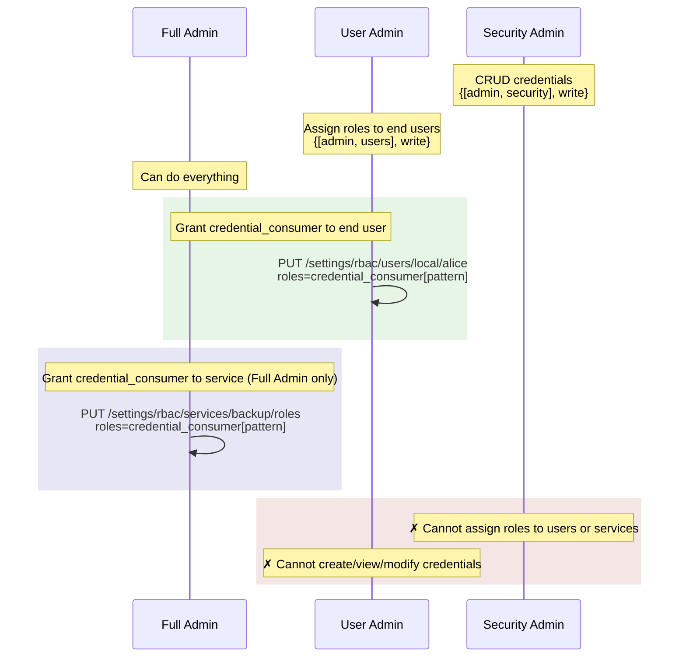

# Credential Store — REST API Reference

This document covers the REST endpoints, request/response formats, error codes, and wire format for the credential store.
For the overall architecture see [architecture.md](architecture.md).
For credential type schemas see [credential-types.md](credential-types.md).

## Admin CRUD Endpoints — `/settings/credentials`

These are the endpoints an administrator uses to create, read, update, and delete credentials.

| Method | Endpoint | RBAC Permission Required | Roles That Satisfy | Description |
|---|---|---|---|---|
| GET | `/settings/credentials` | `{[admin, security], read}` | Security Admin, RO Security Admin, Full Admin | List all credentials (+ warnings, optional `?prefix=`) |
| GET | `/settings/credentials/:id` | `{[admin, security], read}` | Security Admin, RO Security Admin, Full Admin | Get one credential (secrets redacted) |
| POST | `/settings/credentials/:id` | `{[admin, security], write}` | Security Admin, Full Admin | Create a credential |
| PUT | `/settings/credentials/:id` | `{[admin, security], write}` | Security Admin, Full Admin | Full-replace update (`type` field is immutable) |
| DELETE | `/settings/credentials/:id` | `{[admin, security], write}` | Security Admin, Full Admin | Delete a credential |

**Credential ID constraints:**

- A credential ID is a string path up to **128 characters** long.
- Must contain only **ASCII printable characters** (no spaces).
- Supports hierarchical paths (e.g. `backup/prod/s3`).

## Credential Store Settings — `/settings/credentialStore`

| Method | Endpoint | RBAC Permission Required | Roles That Satisfy | Description |
|---|---|---|---|---|
| GET | `/settings/credentialStore` | `{[admin, security], read}` | Security Admin, RO Security Admin, Full Admin | Read store settings (+ warnings) |
| PUT | `/settings/credentialStore` | `{[admin, security], write}` | Security Admin, Full Admin | Update store settings |
| DELETE | `/settings/credentialStore` | `{[admin, security], write}` | Security Admin, Full Admin | Reset store settings to defaults |

**Settings fields (PUT body, JSON):**

| Field | Type | Default | Description |
|---|---|---|---|
| `configEncryptionOverride` | boolean | `false` | When `false`, enforces a strict link between credentials and encryption. Blocks disabling config encryption if credentials exist, and blocks credential CRUD operations if config encryption is disabled. Set to `true` to bypass these restrictions. |
| `n2nEncryptionOverride` | boolean | `false` | When `false` enforces a best-effort link between credentials and node-to-node encryption. Attempts to block disabling N2N encryption if credentials exist, and attempts to block credential CRUD operations if N2N encryption is disabled. Set to `true` to bypass these restrictions. |

Both fields are **required** in the PUT body.

**GET response** includes the current settings and, if credentials exist in the store, a `warnings` array when config encryption is disabled or n2n encryption is not fully enabled across the cluster.
Example:

```json
{
  "configEncryptionOverride": true,
  "n2nEncryptionOverride": false,
  "warnings": [
    "Stored credentials are not protected by config encryption at rest"
  ]
}
```

See [architecture.md — Storage](architecture.md#storage) for full details on the encryption requirements and the rationale for these overrides.

## Service Role Management — `/settings/rbac/services/:name/roles`

| Method | Endpoint | Route Guard | Roles That Satisfy | Description |
|---|---|---|---|---|
| GET | `/settings/rbac/services/:name/roles` | `{[admin, security, admin], read}` | **Full Admin only** | Read current service roles |
| PUT | `/settings/rbac/services/:name/roles` | `{[admin, security, admin], write}` | **Full Admin only** | Assign roles to a service |
| DELETE | `/settings/rbac/services/:name/roles` | `{[admin, security, admin], write}` | **Full Admin only** | Delete all service roles |

> Security Admin has `{[admin, security, admin], none}` and therefore **cannot** read, write, or delete service roles.
> This is by design to prevent privilege escalation.
>
> **Service identity restriction.** Additionally, the PUT and DELETE handlers reject requests from internal users (`@`-prefixed callers in the admin domain) with a 403.
> This prevents a service from granting `credential_consumer` to itself or another service, or from deleting existing service role grants.
> Services may still read their own roles via GET.
> See `reject_service_caller/1` in `menelaus_web_rbac.erl`.

## Granting Consume Permissions

### Granting consume permission to an end user

Use the standard user-management endpoint to assign the `credential_consumer` role with a credential ID pattern.

**Endpoint:** `PUT /settings/rbac/users/:domain/:userId`

**RBAC required by the caller:** `{[admin, users], write}` — i.e. **User Admin** (local or external) or **Full Admin**.
Since `credential_consumer` is not a security role, Security Admin is NOT required.

**Example — grant `alice` consume on credential `n1ql/prod/s3`:**

```bash
curl -X PUT -u Administrator:password \
  http://localhost:8091/settings/rbac/users/local/alice \
  -d "roles=credential_consumer[n1ql/prod/s3]"
```

**Example — grant `alice` consume on all credentials under `n1ql/`:**

```bash
curl -X PUT -u Administrator:password \
  http://localhost:8091/settings/rbac/users/local/alice \
  -d "roles=credential_consumer[n1ql/*]"
```

**Example — grant `alice` consume on ALL credentials:**

```bash
curl -X PUT -u Administrator:password \
  http://localhost:8091/settings/rbac/users/local/alice \
  -d "roles=credential_consumer[*]"
```

> **Note:** The `credential_consumer` role is parameterised by a `credential_id` pattern.
> The pattern supports `*` as a suffix wildcard matching zero or more characters (including `/`).

### Granting consume permission to a service identity

Services have a dedicated endpoint for managing their roles.
Only the `credential_consumer` role is permitted for services.

**Endpoint:** `PUT /settings/rbac/services/:serviceName/roles`

**RBAC required by the caller:** `{[admin, security, admin], write}` — i.e. **Full Admin only**.
Security Admin cannot use this endpoint because it has `{[admin, security, admin], none}`.
User Admin also lacks this permission.
This ensures only the highest-privilege administrator can grant credentials to service identities.

**`:serviceName`** is one of: `n1ql`, `backup`, `index`, `xdcr`, `fts`, `eventing`, `cbas`

**Example — grant backup service consume on `backup/prod/s3`:**

```bash
curl -X PUT -u Administrator:password \
  http://localhost:8091/settings/rbac/services/backup/roles \
  -d "roles=credential_consumer[backup/prod/s3]"
```

**Example — grant backup service consume on ALL credentials:**

```bash
curl -X PUT -u Administrator:password \
  http://localhost:8091/settings/rbac/services/backup/roles \
  -d "roles=credential_consumer[*]"
```

**Read current service roles:**

```bash
curl -u Administrator:password \
  http://localhost:8091/settings/rbac/services/backup/roles
```

**Delete all service roles:**

```bash
curl -X DELETE -u Administrator:password \
  http://localhost:8091/settings/rbac/services/backup/roles
```

### Permission granting — summary diagram



## Guardrails

Guardrails are optional restrictions set when a credential is created or updated.
ns_server enforces **only** `allowedServices`; all other guardrails are the consuming service's responsibility.

| Guardrail | Enforced By | Description |
|---|---|---|
| `allowedServices` | ns_server | Which services may consume (end-user path) |
| `urlWhitelist` | Service | URL allow/disallow lists + allAccess |
| `allowedResources` | Service | Resource-level restrictions |
| `allowedOperations` | Service | Operation restrictions (READ, LIST …) |

### `allowedServices` valid values

`n1ql`, `backup`, `index`, `xdcr`, `fts`, `eventing`, `cbas`

These map to service identities via `misc:identity_name_to_service/1`:

| Service | Identity(ies) |
|---|---|
| n1ql | @cbq-engine |
| backup | @backup, @cbcontbk |
| index | @index, @projector |
| xdcr | @goxdcr |
| fts | @fts |
| eventing | @eventing |
| cbas | @cbas |

### `urlWhitelist` sub-object

| JSON Field | Type | Description |
|---|---|---|
| `allAccess` | boolean | When `true`, permit all URLs |
| `allowedUrls` | string[] | URL patterns that are allowed |
| `disallowedUrls` | string[] | URL patterns that are explicitly blocked |

## Error Codes

Errors returned from `/_cbauth/getCredential/:id` and mapped to Go sentinel errors in `cbauthimpl`:

| HTTP | Error Code | Go Error | When |
|---|---|---|---|
| 403 | `INSUFFICIENT_PERMISSIONS` | `ErrInsufficientPermissions` | User lacks consume RBAC permission |
| 403 | `SERVICE_GUARDRAIL_BLOCKED` | `ErrServiceGuardrailBlocked` | Service not in allowedServices (end user) |
| 403 | `CREDENTIAL_EXPIRED` | `ErrStoredCredentialExpired` | Credential's expiresAt has passed |
| 404 | *(no body)* | `ErrCredentialNotFound` | Credential ID does not exist |
| 503 | `UNSUPPORTED_SCHEMA_VERSION` | `ErrSchemaVersionUnsupported` | Schema version not supported by this build |

## Wire Format (JSON response)

```json
{
  "id": "my-aws-key",
  "type": "aws",
  "schemaVersion": 1,
  "meta": {
    "description": "Production S3 access",
    "createdAt": 1740000000000,
    "createdBy": {"user": "Administrator", "domain": "admin"},
    "expiresAt": 1750000000000,
    "guardrails": {
      "allowedServices": ["n1ql", "index"],
      "urlWhitelist": {
        "allAccess": false,
        "allowedUrls": ["https://s3.amazonaws.com/*"],
        "disallowedUrls": []
      }
    },
    "payloadVersion": "g2gCZAAIY..."
  },
  "fields": {
    "accessKeyId": "AKIA...",
    "secretAccessKey": "wJalrXU...",
    "region": "us-east-1"
  }
}
```

See [credential-types.md](credential-types.md) for the full field reference for each credential type.
