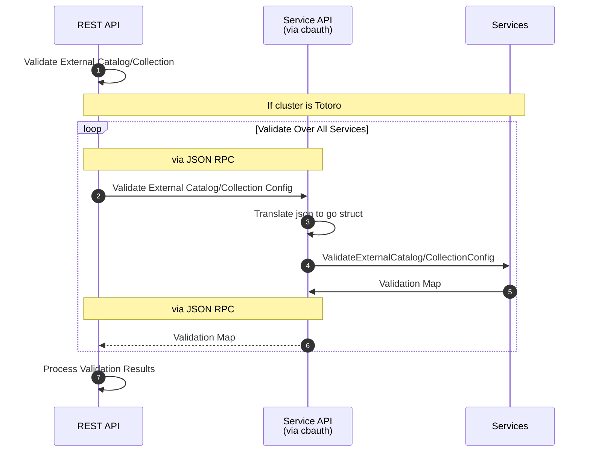

# External Catalog/Collection Validation

To support validation of arbitrary configuration for external catalogs and
collections, ns_server can delegate validation to interested services. A similar
mechanism exists to validate bucket configuration against memcached and other
services. This mechanism effectively exposes configuration from these services
on the REST API via cbauth and ns_server, which increases configuration
flexibility for the user and reduces ongoing workload for ns_server. This allows
services to handle their own configuration through upgrades too.

## Overview

The REST API in ns_server can take an arbitrary set of fields, including those
that ns_server cares about. It validates the parameters that matter to
ns_server, then marshalls the parameters and any other useful information into a
JSON structure to hand off to the services via JSON RPC and cbauth for further
validation. Upon validation of the payload by the services, ns_server can
consider the responses and determine if the payload is valid or not. If it is
not, appropriate error messages from the services can then be passed back to the
client. If it is valid, the catalog/collection can be stored.

### Example Validation of Opaque Metadata for External Collection


## Validation Payload

In the validation payload ns_server will send the cluster compatibility version.
This will allow services to guard against a specific cluster version when
either validating or exposing configuration.

For consistency with other REST APIs, configuration parameters ought to be named
in camelCase, but this is up to the services.

## Validation Response (Validation Map)

The response from the services should look similar to that given by the bucket
configuration API, this allows ns_server to re-use code where possible and
reduces cognitive overhead by having fewer standards/formats.

### Validation Success

The success response (as JSON) for some key should look as follows:
```
{
    "catalogType":
        {
            "value":"ICEBERG",
            "visibility":"public"
        },
    ...
},
```

Here we have an example of a successful validation for a key,
`catalogType`. It's value, a tuple, contains 2 elements.

### Value
`value` denotes the value that should be used. This should be the value that the
user has set, if the user did so via the Validation Payload. Otherwise, it
serves as a default value provided by the service.

### Visibility
`visibility` denotes whether the parameter should be exposed on the REST API
if it has not been set by the user (on the read/GET path). This  allows the
services to specify a wide range of supported parameters, without the need to
advertise them all to the user. Services can also guard the visibility of new
parameters against the cluster compatibility mode, new  parameters can be hidden
til fully supported by the cluster.

### Validation Error

The error response (as JSON) for some key should look as follows:


```
{
    "historyRetentionSeconds":
        {
            "error":"invalid"
            "message":"Value is not integer"
        },
    ...
}
```

Here we have an example of a failing validation for a key,
`historyRetentionSeconds`. Its value, a tuple, contains 2 elements.

### Error
`error` denotes an error message that can be used to inform ns_server whether
this service is interested in the parameter. The value `unsupported` does this.
Any other value can be returned for other errors. In the example above,
`invalid` is used, and ignored, by ns_server.

### Message
`message` denotes the message that is passed to the user on the REST API in the
event of an error. It should be considered user-facing.

## Parameter Names
As mentioned previously they should be camelCase for the sake of consistency
with the existing REST APIs. The namespace will be shared by all services, so
any service specific values ought to be prefixed accordingly to avoid conflicts.
