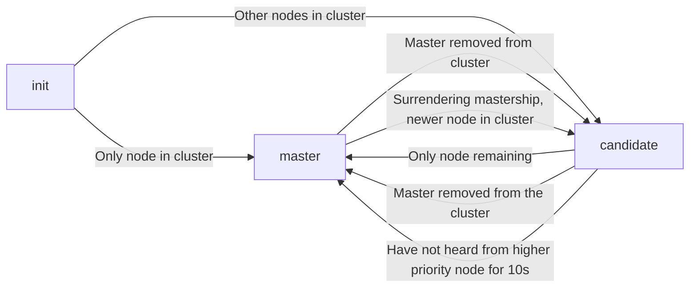

```mermaid
%%{ init: { 'flowchart': { 'curve': 'monotoneX' } } }%%
flowchart LR
init --> | Only node in cluster | master
init --> | Other nodes in cluster | candidate
candidate --> | Only node remaining | master
candidate --> | Master removed from the cluster | master
candidate --> | Have not heard from higher priority node for 10s | master
master --> | Master removed from cluster | candidate
master --> | Surrendering mastership, newer node in cluster | candidate
```